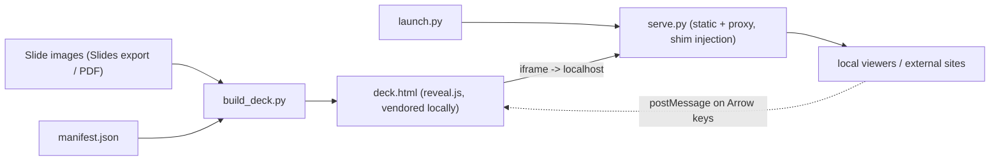

# InteractiveGoogleSlides

Author your talk in **Google Slides** (or any tool that exports slide images),
then present it as a **reveal.js** deck where chosen slides get a **live,
interactive `<iframe>` window** into a local HTML app or an external website.

Google Slides can't put live HTML on a slide (it flattens everything to an
image). This project bridges that gap without asking you to abandon your normal
authoring workflow: keep the deck in Slides, and a small conversion step turns
the exported images into an interactive HTML deck.

Everything runs locally, so it's fully interactive during a talk with no cloud
service in the loop.

## The interaction contract

> **Left / Right arrows always change slides. Every other input is
> interactivity.**

That contract is what makes embedded viewers usable inside a deck. It is
enforced by a tiny shim (`serve.py`) injected into each viewer at serve time
(your viewer files are never modified on disk). The shim captures only
`ArrowLeft` / `ArrowRight` in the capture phase - so it beats things like
three.js `OrbitControls` - and posts the parent deck to navigate. Mouse drag,
wheel, and every other key stay inside the viewer. The deck side
(`preventIframeAutoFocus` + a `message` listener, both set up by `build_deck.py`)
completes the loop.

Because the proxy injects the shim server-side, this even works for **external
websites** you don't control (and it bypasses `X-Frame-Options`, since the
browser sees a `localhost` origin).

## Quick start: the demo (no Google Slides needed)

```bash
python make_demo.py
python launch.py --manifest demo/manifest.json --build
```

This generates four SVG "slides" and opens the deck. Slide 3 is a local three.js
cube (drag to orbit); slide 4 is the **live OpenStreetMap website** (drag to
pan). On both, Left/Right still change slides.

(The two interactive demo slides need internet - three.js CDN + OSM tiles. Your
own local viewers can run fully offline.)

## The workflow for a real deck

1. **Author** your deck in Google Slides as usual.
2. **Export**: File -> Download -> PDF (one file), or PNG per slide into a
   folder (e.g. `slides/`).
3. **Write a manifest** (`manifest.json`, copy from `manifest.example.json`):
   point `images`/`pdf` at your export, set `static_root` to where your local
   viewer HTML lives, and add an embed per interactive slide.
4. **Present**:

   ```bash
   python launch.py --manifest manifest.json --build
   ```

   This (re)builds `deck.html`, starts the viewer servers, and opens the deck.
   `Ctrl-C` stops the servers. Re-run after any Slides edit.

### Optional: auto-sync from Google Slides

No Drive API or OAuth required. Google serves any *link-viewable* deck as a PDF
at `https://docs.google.com/presentation/d/<ID>/export/pdf`. Share your deck as
"Anyone with the link -> Viewer", then:

```bash
# re-pull + rebuild whenever the deck changes
python sync_slides.py --url "<slides url>" --manifest manifest.json --build --watch 30
```

Set your manifest's `"pdf": "deck.pdf"` so `build_deck.py` splits the synced PDF
into slide backgrounds (needs `pip install pymupdf`).

### Optional: keep GIFs and videos *live* (Slides API import)

The PDF/PNG export flattens everything — an animated GIF becomes one frame, a
video becomes its poster still. If you connect to the **Google Slides API**
instead, you can rip the media *out* and keep it live: each slide is still
rendered to a flat background, but every image/GIF and every YouTube/Drive video
is re-attached as a live overlay at its exact on-slide position, using the same
interaction-contract shim as any other embed.

```bash
# Friendliest: one tab does sign-in + file picker + a live progress bar, then the
# finished interactive deck opens right there (no separate build/launch step).
python slides_import.py --studio --out mydeck --client client_secret.json

# Or the plain picker (build + launch yourself):
python slides_import.py --picker --out mydeck --build
python launch.py --manifest mydeck/manifest.json
```

The `--picker` flow uses the non-sensitive `drive.file` scope, so there's no
scary permission warning and no Google verification needed - you just sign in
and pick your deck. Other auth models (service account for headless use, or
broader-scope OAuth) are also supported. Auth is one-time; later runs refresh
silently. See **[IMPORT.md](IMPORT.md)** for setup and how it maps Slides
elements to overlays.

## Manifest reference

```jsonc
{
  "title": "My Talk",
  "width": 1280, "height": 720,     // match your slide aspect ratio
  "reveal_theme": "black",           // any reveal.js theme name
  "images": "slides",                // dir of PNG/JPG/SVG,  OR  "pdf": "deck.pdf"
  "static_root": "viewers",          // where local viewer HTML lives (default: manifest dir)
  "embeds": [
    // A self-contained local viewer, served with the shim injected:
    { "slide": 3, "serve": "static", "path": "my_viewer.html",
      "rect": { "x": 8, "y": 14, "w": 60, "h": 72 } },

    // A local app with its own server (started for you, then proxied):
    { "slide": 6, "serve": "proxy", "path": "index.html",
      "backend": { "cmd": ["python", "-m", "http.server", "8000"],
                   "port": 8000, "cwd": "my_app" },
      "rect": { "x": 5, "y": 10, "w": 90, "h": 80 } },

    // A live external website, proxied so the shim can be injected:
    { "slide": 8, "serve": "proxy",
      "path": "export/embed.html?bbox=-0.13,51.50,-0.11,51.51&layer=mapnik",
      "backend": { "base": "https://www.openstreetmap.org" } }
  ]
}
```

- **`serve: "static"`** - for viewers that only reference relative files.
  Served from `static_root` (port 9100) with the shim injected.
- **`serve: "proxy"`** - for viewers that use root-relative `fetch('/...')`, or
  for external sites. `launch.py` starts the backend (if `cmd` given), then a
  shim-injecting proxy in front of it, so the viewer sees a normal origin.
- **`rect`** is a percent box within the slide; omit it for a full-bleed viewer.

## How it fits together



## Files

| File | Role |
|------|------|
| `build_deck.py` | Turns exported slide images + manifest into `deck.html`. |
| `serve.py` | Shim-injecting static server / reverse proxy. |
| `launch.py` | Starts the servers a manifest needs and opens the deck. |
| `sync_slides.py` | Pulls a link-viewable Google Slides deck as PDF (optional watch). |
| `slides_import.py` | Imports a deck via the Slides API, keeping GIFs/videos live ([IMPORT.md](IMPORT.md)). |
| `slides_auth_picker.py` | No-warning `drive.file` + Google Picker auth used by `slides_import.py`. |
| `slides_studio.py` | `--studio` server: sign-in + Picker + live progress bar, then serves the finished deck in the same tab. |
| `deckcommon.py` | Shared manifest parsing + port assignment. |
| `make_demo.py` | Generates the self-contained demo. |
| `manifest.example.json` | Copy to `manifest.json` and edit. |

## Requirements

- Python 3.10+ (core tooling is standard-library only).
- `pymupdf` only if you split an exported PDF (`pip install -r requirements.txt`).
- `google-api-python-client`, `google-auth`, `google-auth-oauthlib` only for the
  live-media Slides API import (`slides_import.py`; see [IMPORT.md](IMPORT.md)).
- A modern browser. reveal.js is vendored locally into `vendor/` on first build,
  so the deck framework has no CDN dependency (pass `--cdn` to opt out).

## Notes and limitations

- Some external sites block framing via `Content-Security-Policy:
  frame-ancestors`; those cannot be embedded even through the proxy.
- Heavy viewers lazy-load (`data-src` + `viewDistance: 1`) so only the viewer
  near the current slide boots.
- Proxied backends still need whatever runtime the viewer itself requires;
  `launch.py` starts the process but does not install its dependencies.

## License

MIT - see [LICENSE](LICENSE).
